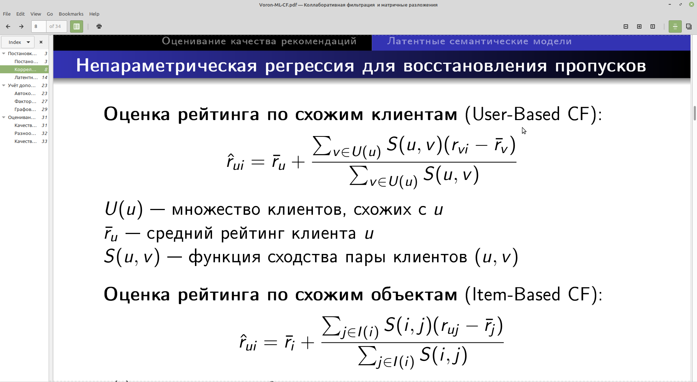

# Flask-приложение с сервисом рекомендации блюд по отзывам пользователей

## Подготовка к запуску:
- Перед запуском необходимо установить дополнительные модули для python: pip3 install -r requirements
- Необходимо создать SQLite db (файл webapp.db) для нашего веб-приложения: python3 create_db.py
- Создание пользователей перед запуском: python3 create_admin.py
- Перед запуском необходимо загрузить данные в базу с помощью скрипта: ./load_data.sh

## Запуск веб-приложения:
- Для Windows: set FLASK_APP=webapp && set FLASK_ENV=development && set FLASK_DEBUG=1 && flask run
- Для Unix/Mac: ./run_webapp.sh или
export FLASK_APP=webapp && export FLASK_ENV=development && export FLASK_DEBUG=1 && flask run

## Меню веб-приложения:
- Главная страница
- Логин
- Выход
- Рекомендация по типу кухни
- Рекомендация по типу блюда
- Создание рецепта
- Поиск
- Перерасчет модели рекомендации блюд

## Рекомендация блюд на основе Collaborative Filtering
Наиболее популярный рецепт вычисляется по следующей формуле:

## End
